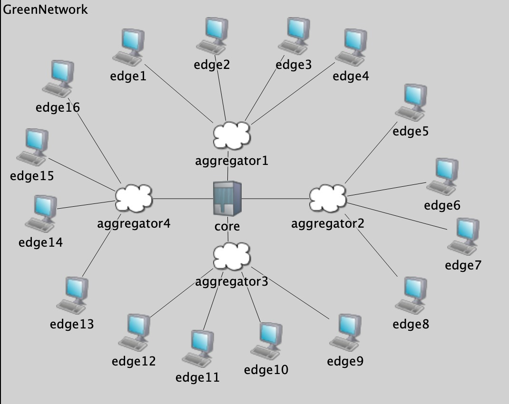

# CS244 - Ziyi, Rayan, Muyao, Jihao

### User Guide

To run the simulation, you should:

* Install OMNeT++.
* Create an empty project named `greenwireless`.
* Copy `greenwireless.cpp`,`greenwireless.msg`, `greenwireless.ned`, `greenwireless_m.cpp`,`greenwireless_m.h`,`omnetpp.ini` to project folder.
* Run the simulation
* The main branch simulates the scenario where solar energy varies in the day.
* The buffer branch simulates the scenario where solar energy heavily fluctuate in 100 second.

